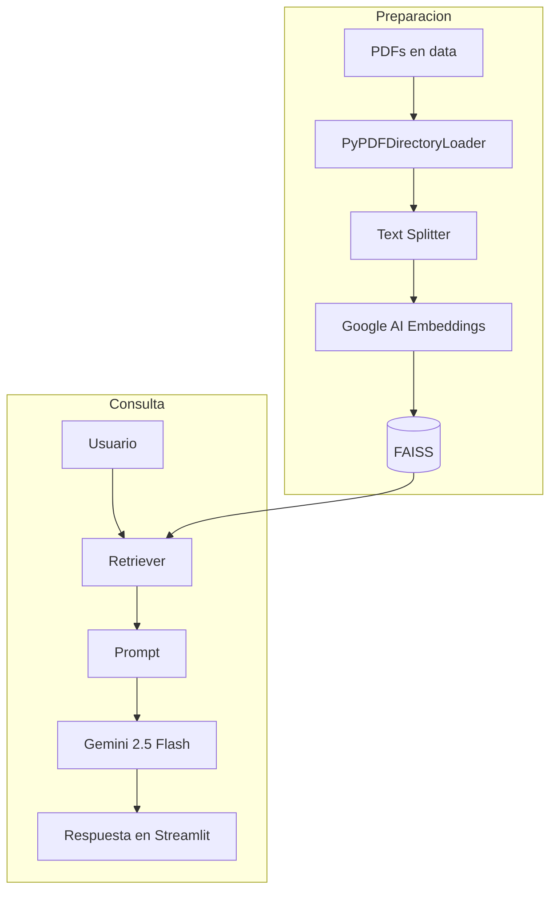
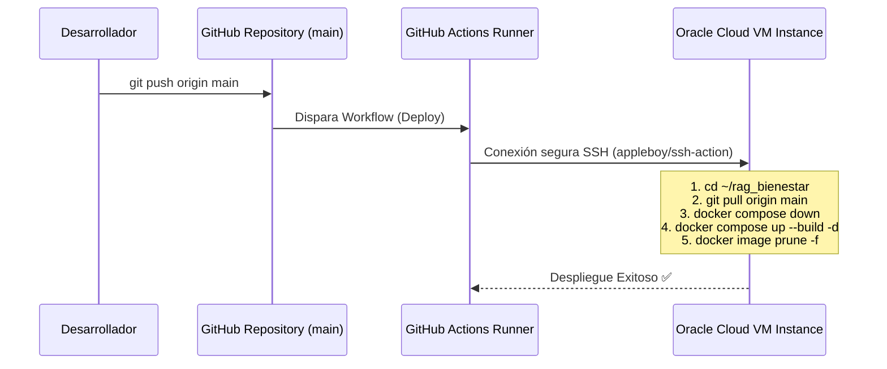

# 🤖 Asistente de Bienestar - RAG (Retrieval-Augmented Generation)

[](https://www.python.org/)
[](https://streamlit.io/)
[](https://www.langchain.com/)
[](https://www.docker.com/)
[-F80000.svg?logo=oracle&logoColor=white>)](https://www.oracle.com/cloud/)
[](https://github.com/features/actions)

Este proyecto es un **Asistente Virtual Inteligente** basado en la arquitectura **RAG (Retrieval-Augmented Generation)**, diseñado para responder consultas complejas sobre el **Programa de Bienestar de Salud**.

Fue desarrollado como respuesta al challenge del programa **Oracle Next Education (ONE)** en colaboración con **Alura Latam**, y demuestra una integración completa de software de vanguardia: desde la ingesta de documentos PDF y base de datos vectorial local, hasta el despliegue continuo automatizado (CI/CD) en la nube mediante contenedores Docker.

---

## 🛠️ Arquitectura del Sistema

El flujo de información y procesamiento de consultas sigue el siguiente diseño:



---

## ✨ Características Clave

- **Ingesta Automatizada de PDF**: Procesa documentos oficiales de bienestar, realiza un particionamiento de texto dinámico y optimizado (`chunk_size=300`, `chunk_overlap=30`) para garantizar búsquedas vectoriales precisas.
- **Base de Datos Vectorial Local**: Utiliza **FAISS** para un almacenamiento de embeddings ultrarrápido.
- **Modelos de Lenguaje de Última Generación**: Utiliza `gemini-embedding-001` para vectorizar textos y `gemini-2.5-flash` para la generación de respuestas en español natural, conciso y con formato estructurado.
- **Administrador de Paquetes Ultra-rápido**: Configurado enteramente utilizando **uv**, la herramienta moderna de empaquetado para Python que acelera drásticamente la instalación y el desarrollo de dependencias.
- **Contenerización Avanzada**: Dockerizado con soporte multi-etapa y volúmenes persistentes para evitar la pérdida del índice vectorial durante actualizaciones del servicio.
- **Pipeline CI/CD y Auto-despliegue**: Integración continua con **GitHub Actions** que al hacer un push a la rama `main` ejecuta comandos de despliegue remoto seguro vía SSH sobre una Máquina Virtual en **Oracle Cloud (OCI)**.

---

## 💻 Pila Tecnológica & Palabras Clave

- **Inteligencia Artificial / IA Generativa**: RAG (Retrieval-Augmented Generation), Large Language Models (LLM), Embeddings vectoriales.
- **Procesamiento de Lenguaje Natural (NLP)**: LangChain, LangChain Community, LangChain Google GenAI, Google Gemini API, FAISS.
- **Desarrollo Frontend / Backend**: Python 3.13, Streamlit, PyPDF, Python-Dotenv.
- **DevOps / Infraestructura en la Nube**: Docker, Docker Compose, GitHub Actions (CI/CD), SSH deployment, Oracle Cloud Infrastructure (OCI), Compute Instances (VM), Ubuntu Server.
- **Herramientas de Productividad**: uv (Astral).

---

## 📸 Capturas del Proyecto (Sugerencias visuales)

1. **Interfaz del Asistente en Funcionamiento**:


2. **Pipeline de GitHub Actions Exitoso**:


3. **Consola de la Máquina Virtual en OCI / Docker corriendo**:


## 🚀 Guía de Instalación y Uso Local

### 1. Requisitos Previos

Asegúrate de tener instalado:

- **Python 3.13** o superior.
- **uv** (Recomendado para una instalación instantánea): `pip install uv` (o vía script oficial).

### 2. Configurar Variables de Entorno

Crea un archivo `.env` en la raíz del proyecto con la clave API de Google AI Studio:

```env
GOOGLE_API_KEY=tu_api_key_de_gemini_aqui
```

### 3. Instalar Dependencias

Instala todas las librerías necesarias de forma instantánea usando `uv`:

```bash
uv venv
uv pip install -r pyproject.toml
```

### 4. Generar el Índice Vectorial (Base de Datos)

Coloca los documentos PDF correspondientes al Programa de Bienestar dentro del directorio `data/` y ejecuta el indexador:

```bash
uv run python src/database.py
```

Este proceso procesará los PDFs, creará los embeddings de Gemini y los guardará localmente en el directorio `vectorstore/`.

### 5. Ejecutar la Aplicación Streamlit

Inicia el panel interactivo del asistente de bienestar:

```bash
uv run streamlit run app.py
```

Abre en tu navegador la dirección indicada (generalmente `http://localhost:8501`).

---

## 🐳 Ejecución con Docker

Si deseas probar la aplicación simulando el entorno de producción localmente con Docker:

```bash
# Construir y levantar el contenedor en el puerto local 80
docker compose up --build -d
```

El contenedor cargará de forma persistente la carpeta `./vectorstore` asegurando que las búsquedas funcionen sin necesidad de reconstruir la base de datos dentro del contenedor en cada inicio.

---

## ☁️ Despliegue Continuo (CI/CD) en Oracle Cloud (OCI)

El proyecto cuenta con un flujo automatizado en [.github/workflows/deploy.yml](file:///.github/workflows/deploy.yml) que realiza las siguientes acciones de forma automática al hacer `git push origin main`:



### 🏗️ Configuración de la Infraestructura en OCI

Para soportar el despliegue y garantizar la accesibilidad de la aplicación en producción, se configuró el entorno en Oracle Cloud Infrastructure (OCI) con los siguientes componentes:

1. **Compartimento (`rag-cmpt`)**: Se creó un compartimento dedicado en OCI para mantener aislados y organizados los recursos del proyecto.
2. **VCN (Virtual Cloud Network)**: Se configuró una red virtual de nube junto con su subred pública correspondiente.
3. **Instancia de Cómputo (VM)**: Se desplegó una máquina virtual dentro de la subred pública de la VCN.
4. **Reglas de Ingreso en OCI**: Se añadió una regla de seguridad de entrada (Ingress Rule) en la _Security List_ de la subred para permitir el tráfico HTTP a través del **puerto 80** desde cualquier origen (`0.0.0.0/0`).
5. **Firewall de la Instancia**: Se abrieron las reglas del firewall local de Linux (a través de `firewalld`) en la máquina virtual para permitir la entrada por el **puerto 80**, asegurando la visibilidad del contenedor de Streamlit hacia la web.

### Secretos requeridos en GitHub

Para habilitar el despliegue automático, se configuraron los siguientes **Repository Secrets** en GitHub:

- `OCI_HOST`: Dirección IP pública de la instancia VM en Oracle Cloud.
- `OCI_USERNAME`: Nombre del usuario de conexión SSH (ej. `opc`).
- `OCI_KEY`: Clave privada SSH asociada a la VM.
- `OCI_PORT`: Puerto SSH (por defecto `22`).

---

## 🎓 Agradecimientos

Este proyecto fue desarrollado bajo la guía y desafíos del programa **Oracle Next Education (ONE)** y la plataforma de educación tecnológica **Alura Latam**. Agradecemos la oportunidad de capacitar a miles de desarrolladores en tecnologías en la nube e Inteligencia Artificial de vanguardia.

---
